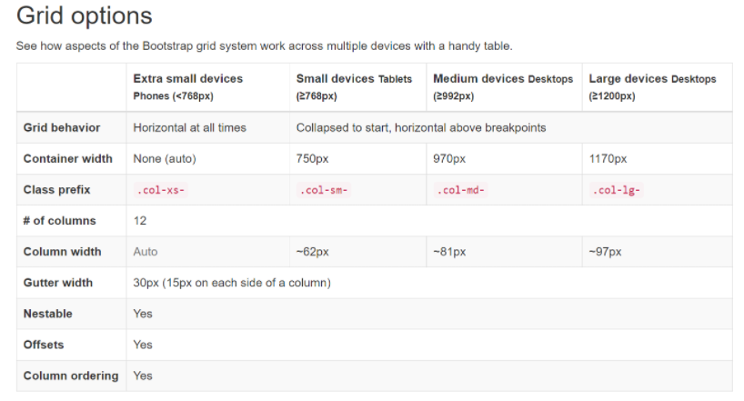

```{r, include = FALSE}
knitr::opts_chunk$set(
  collapse = TRUE,
  comment = "#>"
)
```

## What is a breakpoint?
When designing for the web, it is important to keep in mind what different users will reach you in different devices with different screen sizes and orientations.

In the early days of web design, pages were built to target a particular screen size. If the user had a larger or smaller screen than the designer expected, results ranged from unwanted scroll bars to overly long line lengths, and poor use of space.

As more diverse screen sizes became available, the concept of responsive web design (RWD) appeared, a set of practices that allows web pages to alter their layout and appearance to suit different screen widths, resolutions, etc.

## Responsive design
The term responsive design was coined by Ethan Marcotte in 2010 and described the use of multiple techniques:

- Fluid grids, something which was already being explored by Gillenwater, and can be read up on in Marcotte's article, Fluid Grids (published in 2009 on A List Apart).

- Fluid images. Using a very simple technique of setting the max-width property to 100%, images would scale down smaller if their containing column became narrower than the image's intrinsic size, but never grow larger. This enables an image to scale down to fit in a flexibly-sized column, rather than overflow it.

- The third key component was the media query. Media Queries enable the type of layout switch that Cameron Adams had previously explored using JavaScript, using only CSS. Rather than having one layout for all screen sizes, the layout could be changed. Sidebars could be repositioned for the smaller screen, or alternate navigation could be displayed.

## Media Queries
Responsive design was only able to emerge due to the media query. The Media Queries Level 3 specification became a Candidate Recommendation in 2009, meaning that it was deemed ready for implementation in browsers.

Media Queries allow us to run a series of tests (e.g. whether the user's screen is greater than a certain width, or a certain resolution) and apply CSS selectively to style the page appropriately for the user's needs.

## Breakpoints
By defining a set "points" where these Media Queries will apply its different rules, we are effectively creating breakpoints where the styling and layout of the page changes. Many frontend frameworks reuse a set of tested and tried breakpoints, making that set of breakpoints its `breakpoint system`.

Example bootstrap 5 breakpoints:
- xs: Screen width from 0 to 576px
- sm: Screen width above 576px
- md: Screen width above 768px
- lg: Screen width above 992px
- xl: Screen width above 1200px
- xxl: Screen width above 1400px

Keep in mind that users expect any website to be perfectly complementary with every single device they own – desktop, tablet, or mobile. If a website’s responsive design does not align with a certain device resolution (especially a commonly used device), the site is at risk of missing out on a segment of its target audience. Avoid this by investing time and research into defining breakpoints at the beginning of a project.

The amount of effort that goes into defining responsive breakpoints is directly proportional to the experience of the end-user.

## Breakpoints in Shiny

Depending on the CSS framework that is being used in your project, different systems are in place to allow this to be a bit more automated, if you are familiar with base shiny, you might have even used these systems without realizing, by using the `fluidRow()` function. `fluidRow()` will trigger layout changes to your `columns` at specific screen sizes, based on [bootstrap 3](https://shiny.rstudio.com/articles/layout-guide.html) breakpoints (The base CSS framework in shiny).

While the `fluidRow()` solution is quite easy to use, it also comes with many constrains and does not allow for a very fine control of these layout changes. For complex enough layouts, you might even need to write additional CSS to add new behavior or specific elements or screen sizes.

## Breakpoints with imola

Imola takes a slightly different approach to breakpoints; Out of the box it uses the same breakpoints as base shiny (bootstrap 3) and for each function named attribute you are able to pass either a value for that attribute or a named list of different values for different breakpoints.

As a practical example, lets say we have the following grid areas in a gridPanel():

``` r
# as a gridPanel() argument
areas = c(
  "area1 area1 area1",
  "area2 area3 area3",
  "area2 area3 area3"
)
# or
areas = list(
  c("area1", "area1", "area1"),
  c("area2", "area3", "area3"),
  c("area2", "area3", "area3")
)
```

This grid contains 3 areas (`area1`, `area2`, `area3`), with `area2` serving a sidebar. Viewing this grid on a small screen could lead to a very small sidebar, so one solution is to modify this grid specifically for a breakpoint that targets mobile.

As mentioned before, shiny and imola, by default, use the bootstrap 3 breakpoint system, that contains a few different breakpoints:



We can see what names imola expects for each of these using either `getBreakpointSystem()` or checking the option directly with `getOption("imola.breakpoint.systems")$bootstrap3`

Back to our case, we want to target small devices, we target these via `xs`, and build our grid argument as a named list instead.

``` r
# as a gridPanel() argument
areas = list(
  default = c(
    "area1 area1 area1",
    "area2 area3 area3",
    "area2 area3 area3"
  ),
  xs = c(
    "area1",
    "area2",
    "area3"
  )
)
```

All `gridPanel()` and `flexPanel()` arguments that affect the styling of the panel allow this behavior for the use of breakpoints. See each function documentation for more details.

By default, the bootstrap 3 breakpoint system is active and returned when `getBreakpointSystem()` is called. This means that with no configuration, the available names to use when using the breakpoint system in other arguments should be ("xs" "sm" "md" "lg" "xl")

You can manually list available breakpoints, in the active breakpoint system using:

```R
names(getBreakpointSystem())
[1] "xs" "sm" "md" "lg" "xl"

# or explore the full details of the system with
getBreakpointSystem()
```

If you would like to switch to a different breakpoint system, imola comes with a few different built in systems based on popular css frameworks:
```R
names(getOption("imola.breakpoint.systems"))
[1] "bootstrap3" "bootstrap5" "bulma"      "foundation"
```

Each system has its own breakpoint naming, based on the framework they originate in:
```R
# Bootstrap 5 system
names(getOption("imola.breakpoint.systems")[["bootstrap5"]])
[1] "sm"  "md"  "lg"  "xl"  "xxl"

# bulma system
names(getOption("imola.breakpoint.systems")[["bulma"]])
[1] "tablet"     "desktop"    "widescreen" "fullhd"

# foundation system
names(getOption("imola.breakpoint.systems")[["foundation"]])
[1] "tablet"     "desktop"    "widescreen" "fullhd"
```
The active system can be changed using `setActiveBreakpointSystem()`.

It is also possible to extend the currently active system (`getBreakpointSystem()`) with additional breakpoints with the `registerBreakpoint()` and `unregisterBreakpoint()`.
```R
# add a new breakpoint
registerBreakpoint("mycustombreakpoint", min = 300, max = 500)

names(getBreakpointSystem())
[1] "xs" "sm" "md" "lg" "xl" "mycustombreakpoint"
```

It is recommended to define the breakpoint system for the application globally before UI definitions, but the `breakpoint_system` argument in panel functions allows for more flexibility when it comes to reuse components from other projects.

NOTE: Imola reserves the special `default` name for values that are used by default, outside of any given breakpoint boundaries (`default` is the rule, breakpoints overwrite `default` for specific screen sizes).


## Best Practices for adding Responsive Breakpoints

- Develop for mobile-first – By developing and designing mobile-first content, the developer and designer receive multiple benefits. It is more difficult to simplify a desktop experience for mobile screens than it is to expand a mobile view for desktop screens. When a design is mobile-first, developers address what is most necessary, and can then make additions to match the preferences of desktop users.

- Always keep major breakpoints in mind. This usually means common screen sizes (480px, 768px, 1024px, and 1280px).

- Before choosing major breakpoints, use website analytics to discern the most commonly used devices from which your site is accessed. Add breakpoints for those screen sizes first.

- An intelligent method is to hide or display elements at certain breakpoints. If necessary, switch content or features at breakpoints. For example, consider implementing off-canvas navigation for smaller screens and a typical navigation bar for larger ones.

- Don’t define standard breakpoints for responsive design on the basis of device size. The primary objective of responsive design breakpoints is to display content in the best possible way. So, let the content be the guide. Add a breakpoint when the content and design requires it.
