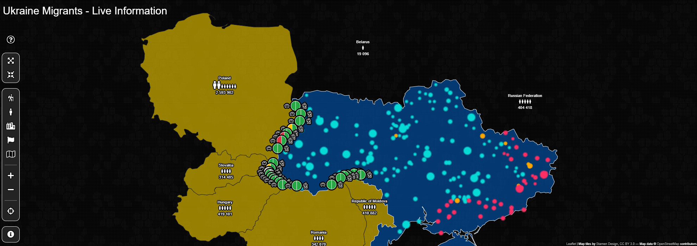

```{r, include = FALSE}
knitr::opts_chunk$set(
  collapse = TRUE,
  comment = "#>"
)
```




-   Usage examples: https://sparktuga.shinyapps.io/imola-examples/
-   Built in templates preview: https://sparktuga.shinyapps.io/imolatemplates/
-   UA Migration Tracker (Full code available): http://uaborder.com/
