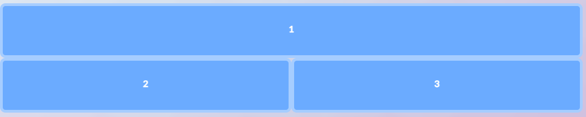
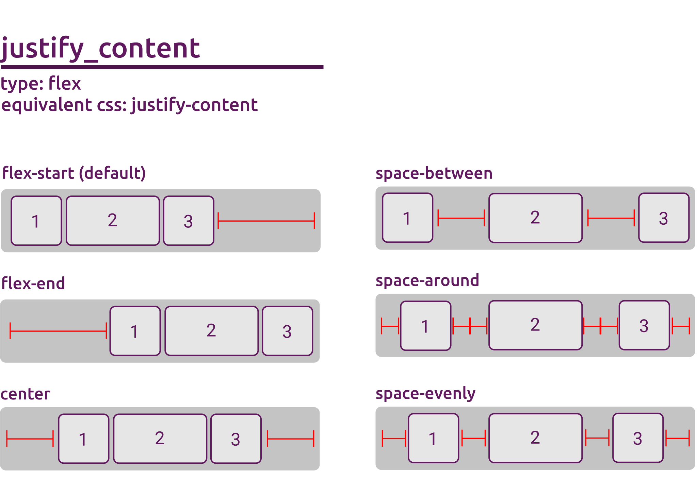
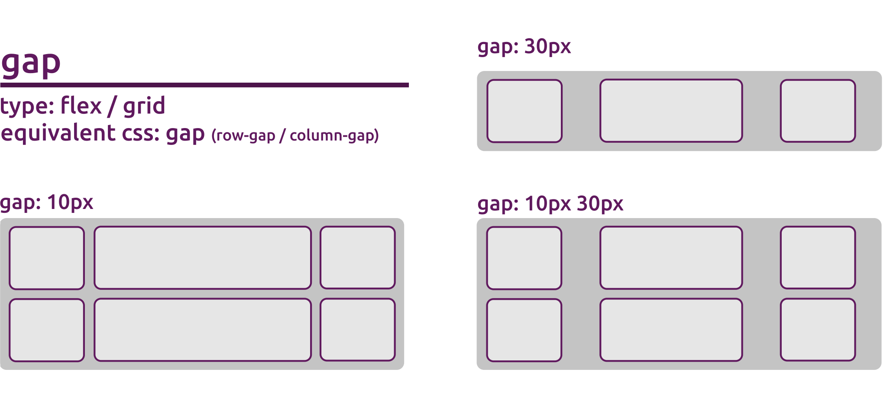
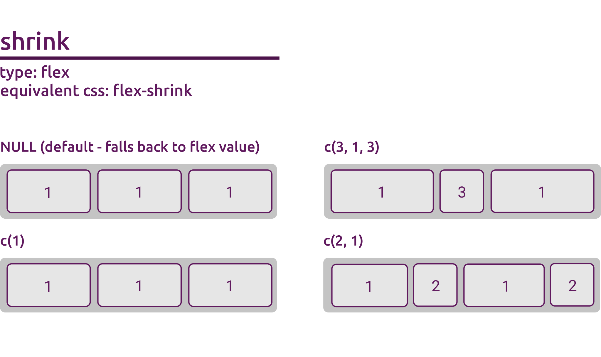
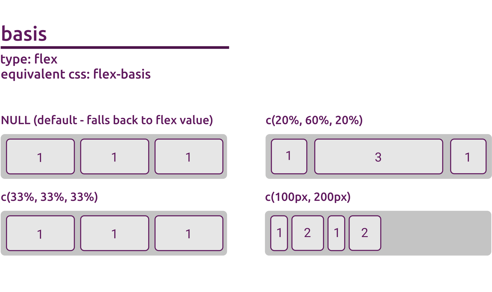

```{r, include = FALSE}
knitr::opts_chunk$set(
  collapse = TRUE,
  comment = "#>"
)
```

```{r echo = FALSE}
htmltools::tags$script(src = "static/flexbox.js")
htmltools::tags$link(rel = "stylesheet", type = "text/css", href = "static/flexbox.css")
```

The imola flex functions family focuses on providing support for the CSS flexbox standard. In imola you can find 2 functions that allow you to create a new grid component. `flexPanel()` and `flexPage()`.

Similar to what happens in the grid family, `flexPage()` is simply a wrapper for `flexPanel()` that allows you to create a page UI element without the need of using any of the built in shiny functions.

If you're interested in more information about the full array of options in the CSS flexbox standard from the CSS side, I recommend [this article](https://css-tricks.com/snippets/css/a-guide-to-flexbox/) to get you started.

---

## Available arguments
In imola, the main functions used to generate flex containers are `flexPanel()` and `flexPage()`. There's a lot of arguments going on here, so lets go over what each option can do:

```R
flexPanel(
  ...,
  template = NULL,
  direction = "row",
  wrap = "nowrap",
  justify_content = "flex-start",
  align_items = "stretch",
  align_content = "flex-start",
  gap = 0,
  flex = c(1),
  grow = NULL,
  shrink = NULL,
  basis = NULL,
  breakpoint_system = getBreakpointSystem(),
  id = generateID()
)
```

```R
flexPage(
  ..., # Any argument that can be passed to flexPanel()
  title = NULL,
  fill_page = TRUE,
  dependency = bootstrapLib()
)
```

---

## ...
Tag attributes (named arguments) and children (unnamed arguments).
A named argument with an `NA` value is rendered as a boolean attribute.

Named arguments can be used to provide additional values to the container
of the grid.

Visit https://www.w3schools.com/tags/ref_attributes.asp for a list of valid HTML attributes.

Children may include any combination of:

- Other tags objects
- [HTML()] strings
- [htmlDependency()]s
- Single-element atomic vectors

`...` main purpose is to add content to your panel, but it can also be used to tweak your HTML generation, allowing a very similar behavior to traditional HTML tag functions provided by `htmltools`, and letting you customize your HTML tag. By default using these functions behaves similar to using `div()`, with additional styles being added to meet our layout expectations.

This means if we ignore the extra styling created by imola, the following call:
```R
flexPanel(attribute = "foo", bar = NA, p("some content"))
```
will generate the following HTML:
```html
<div attribute="foo" bar>
  <p>some content</p>
</div>
```

---

## template
The name of the template to use as a base for the grid, or the resulting value from using `gridTemplate()` to generate a template object.

When passing a string as a value if the template is not registered you will get a error message. Valid template strings are either built in or created using `registerTemplate()`.

A quick way to see all registered templates (for flex functions) is to use `names(listTemplates("flex"))`:

```R
# names(listTemplates("flex"))
# Default built in flex templates

[1] "one-three-alternate" "one-two-alternate"   "small-large-small"   "three-one-alternate" "three-row"           "three-two-alternate"
[7] "two-one-alternate"   "two-row"             "two-three-alternate"
```

Templates that you register also become valid values for the template argument, and will also be displayed when listing available template names:
```R
registerTemplate("flex", "mycustomtemplate",
  direction = "column"
)

# names(listTemplates("flex"))
[1] "one-three-alternate" "one-two-alternate"   "small-large-small"   "three-one-alternate" "three-row"           "three-two-alternate"
[7] "two-one-alternate"   "two-row"             "two-three-alternate" "mycustomtemplate"
```

Any listed template name can then be used as a value, regardless if built in or custom:
```R
flexPanel(template = "two-three-alternate")
```


Visit https://sparktuga.shinyapps.io/imolatemplates/ for a full list of imola's built in templates.

Note: See `listTemplates()` and `registerTemplate()` documentation for more information on those functions, or `vignette("imola-templates")` for a full breakdown regarding templates in imola.

---

## direction
Direction of the flow of elements in the panel.

Accepts a valid css `flex-direction` value (row | row-reverse | column | column-reverse).

```{r echo = FALSE}
htmltools::includeHTML("static/flexbox-direction.html")
```


By default the `row` value is used. Supports named list for breakpoints. See `vignette("imola-breakpoints")` for more on breakpoints.

---

## wrap
Should elements be allowed to wrap into multiple lines.

Accepts a valid css `flex-wrap` value (nowrap | wrap | wrap-reverse).

```{r echo = FALSE}
htmltools::includeHTML("static/flexbox-wrap.html")
```


By default the value `wrap` is used. Supports named list for breakpoints. See `vignette("imola-breakpoints")` for more on breakpoints.

---

## justify_content
Defines the alignment along the main axis.

Accepts a valid css `justify-content` value (flex-start | flex-end | center | space-between | space-around | space-evenly | start | end | left | right).

```{r echo = FALSE}
htmltools::includeHTML("static/flexbox-justify-content.html")
```



By default the value `flex-start` is used. Supports named list for breakpoints. See `vignette("imola-breakpoints")` for more on breakpoints.

NOTE: Since `imola` uses `flex = c("1")` as a default value for flex, you might not see any changes setting a custom value for `justify_content` out of the box. You can set `flex = c("0 1 auto")` to allow children elements to control their own size on the main axis.

---

## align_items
Defines the default behavior for how flex items are laid out along the cross axis on the current line.

Accepts a valid css `align-items` value (stretch | flex-start | flex-end | center | baseline | first baseline | last baseline | start | end | self-start | self-end).

```{r echo = FALSE}
htmltools::includeHTML("static/flexbox-align.html")
```


By default the value `stretch` is used. Supports named list for breakpoints. See `vignette("imola-breakpoints")` for more on breakpoints.

---

## align_content
Aligns a flex container’s lines within when there is extra space in the cross-axis.

Accepts a valid css `align-content` value (flex-start | flex-end | center | space-between | space-around | space-evenly | stretch | start | end | baseline | first baseline | last baseline).

```{r echo = FALSE}
htmltools::includeHTML("static/flexbox-align-content.html")
```


By default the value `flex-start` is used. Supports named list for breakpoints. See `vignette("imola-breakpoints")` for more on breakpoints.

NOTE: Since `imola` uses `flex = c("1")` as a default value for flex, you might not see any changes setting a custom value for `align_content` out of the box. You can set `flex = c("0 1 auto")` to allow children elements to control their own size on the main axis. You might also be interested in using `wrap = wrap` to allow elements to spawn multiple lines to take full advantage of `align_content`.

---

## gap
Controls the space between items. It applies that spacing only between items not on the outer edges. The behavior could be thought of as a minimum gutter, as if the gutter is bigger somehow (because of something like justify-content: space-between;) then the gap will only take effect if that space would end up smaller.

The gap argument controls both the row gap and the column gap at the same time, making its css equivalent `gap`, `row-gap` and `column-gap`. If a single value is given it is used for both row and column gap, but a pair of values separated by a space can also be used for controlling these independently.

Accepts a valid value in css values (`"0"`, `"10px"`, `"20%"`, `"0.5rem"`), or a pair of values separated by space (`"10px 20px"`, `"5% 10%"`, `"10px 5%"`).



By default the value `0` is used. Supports named list for breakpoints. See `vignette("imola-breakpoints")` for more on breakpoints.

---

## flex
A vector of valid css 'flex' values for the child elements. Shorthand for `grow`, `shrink` and `basis`, with the second and third parameters being optional. This means that any combination of 1, 2 or 3 css values for `grow`, `shrink` and `basis` are valid.

Arguments that target child elements individually require a vector of values instead of a single value, with each entry of the vector affecting the nth child element. As an example `c(1, 2, 1)` will set the flex value of the first child to `1`, the second to `2` and the third to `1`.

If the given vector has less entries that the number of child elements, the values will be repeated until the pattern affects all elements in the panel. If the number of entries given is more that the number of child elements, exceeding entries will be ignored. NA can also be used as a entry to skip adding a rule to a specific nth element.

It is usually recommended to use flex instead of the individual parameters, this is because when omitting some of them, flex will actually set the other values intelligently.

An example of this is using a flex value of `1` is actually equivalent to `1 1 0%` (`grow = 1`, `shrink = 1`, `basis = 0%`).

```{r echo = FALSE}
htmltools::includeHTML("static/flex.html")
```

By default the value `c(1)` is used, meaning a value of `1` for every child. You might notice that this is different from the pure css default, but makes more sense in the context of shiny dashboards.
To recover the default css behavior, use `c("0 1 auto")` as a value.

Check the following sections for `grow`, `shrink` and `basis` for more details. Supports named list for breakpoints. See `vignette("imola-breakpoints")` for more on breakpoints.

---

## grow
Defines the ability for a flex item to grow if necessary. It accepts a unitless value that serves as a proportion. It dictates what amount of the available space inside the flex container the item should take up.

If all items have flex-grow set to 1, the remaining space in the container will be distributed equally to all children. If one of the children has a value of 2, that child would take up twice as much of the space either one of the others (or it will try, at least).

```{r echo = FALSE}
htmltools::includeHTML("static/flexbox-grow.html")
```


By default the value NULL is used, meaning it defaults to the value provided in the `flex` argument, which fallback to `1` for each element.

---

## shrink
This defines the ability for a flex item to shrink if necessary. It accepts a unitless value that serves as a proportion. It dictates what amount of the available space inside the flex container the item should take up.

If all items have flex-shrink set to 1, all elements will shrink at an equal rate. If one element has a larger shrink value, it will shrink at a faster rate that the other elements (depending on the difference between the given values).

```{r echo = FALSE}
htmltools::includeHTML("static/flexbox-shrink.html")
```



By default the value NULL is used, meaning it defaults to the value provided in the `flex` argument, which fallback to `1` for each element.

Note: For `shrink` to have any effect, it requires some size (either `width` or `basis`) to be set on the children elements.

---

## basis
Defines the default size of an element before the remaining space is distributed. It can be a length (e.g. 20%, 5rem, etc.) or a keyword.

The `auto` keyword means “look at my width or height property to use as a basis value for calculations”



By default the value NULL is used, meaning it defaults to the value provided in the `flex` argument, meaning `0%` for each element.

---

## breakpoint_system
Optional Media breakpoints to use. Will default to the current active breakpoint system.

For other arguments that support breakpoints, instead of simply passing them a value, you can also provide a named list of valid values.

The names used in that list can be any of the registered breakpoints available in the provided `breakpoint_system` argument (defaults to `getBreakpointSystem()`), as well as the reserved keyword `default`.

See `vignette("imola-breakpoints")` for more details on breakpoints.

---

## id
The panel ID. A randomly generated one is used by default. Providing your own ID will allow you to target the generated HTML tag via CSS or JavaScript if needed.

General rules regarding HTML Ids apply, including the fact that duplicated Ids are not allowed.

For a full list of details on the HTML ID attribute, check https://www.w3schools.com/html/html_id.asp

---

## title
The browser window title (defaults to the host URL of the page). This is the name that appears on the browser tab.

---

## fill_page

Flag to tell the page if it should adjust the page to adjust and fill the browser window size.

When set to true this will force the grid to be at least as tall as the available browser window. This makes the container stretch if the content is smaller, while still allowing it to grow beyond the height of the viewport if necessary.

---

## dependency
The set of web dependencies. This value can be a htmlDependency, for example the shiny bootstrap one (the default) or a [tagList] with different dependencies. Useful if you are using a different UI framework of package with its own required dependencies (or that requires you to suppress bootstrap dependencies)

---
