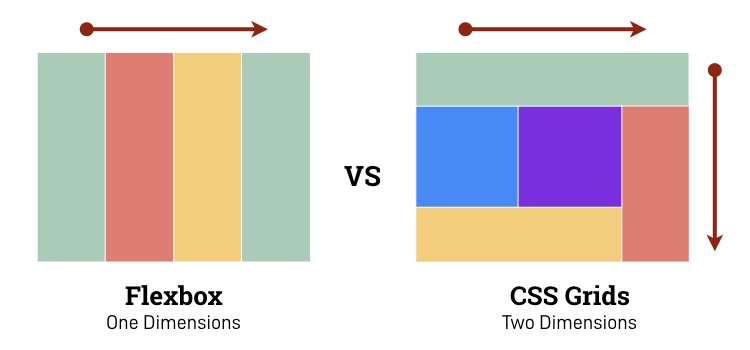
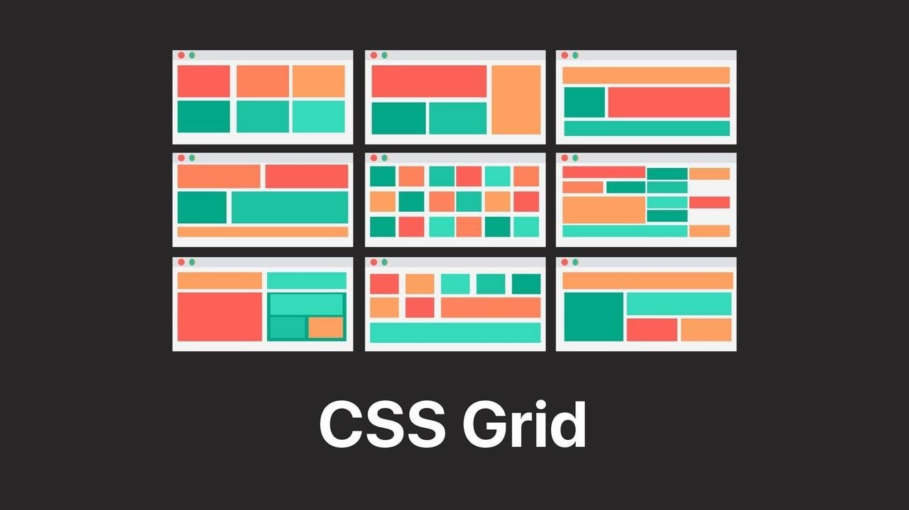
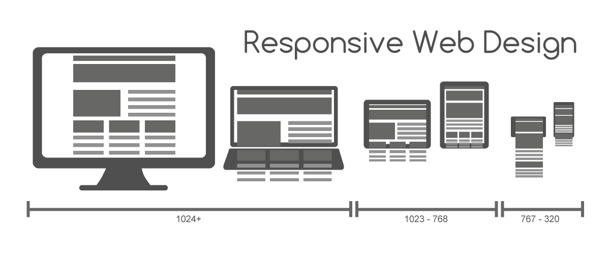

```{r, include = FALSE}
knitr::opts_chunk$set(
  collapse = TRUE,
  comment = "#>"
)
```

```{css, echo = FALSE}
img {
  max-width: 100%;
}
```

Imola's main goal it to give you the tools to work with CSS Flex and CSS Grid directly from R as an alternative to columns and rows.


Using imola can be as simple as using a template in your dashboard, or as deep as building a fully custom layout, complete with different views for different screen sizes.

In addition to the convenient wrapper functions for CSS Flex and CSS Grid, imola also includes support for dealing with different screen sizes as well as saving and reusing layouts via the concept of `breakpoint systems` and `templates`.

---

## Usage

The bread and butter of imola are the `gridPanel()` and `flexPanel()` functions.

They allow you to replace any HTML tag that serves as a container (`div`, `section`, `main`, `nav`, ...) with a tag using one of the CSS layout systems (grid or flex).

While in depth knowledge of CSS Flexbox and CSS Grid is not required to get started, it is recommended to at least be somewhat familiar with them. I recommend [this article](https://developer.mozilla.org/en-US/docs/Web/CSS/CSS_Grid_Layout/Relationship_of_Grid_Layout) to get you up to speed.

If you are looking for more information on a specific system in imola, make sure to check the following vignettes for an in depth view:

-   `vignette("imola-flexbox")` for details on `flexPanel()` and `flexPage()`.
-   `vignette("imola-grid")` for details on `gridPanel()` and `gridPage()`.
-   `vignette("imola-templates")` for information on using imola's templating engine.
-   `vignette("imola-breakpoints")` for information on using imola's breakpoint systems.

---

## Using grid vs flex



Picking between grid and flex might seem tricky. In general flex and Grid serve different purposes and are both incredibly useful. Picking between them typically depends on your use case:

#### Use Flex when:
-   Content sets the size
-   Need horizontal or vertical alignment
-   Layout is one-dimensional
-   Need better older browser support

#### Use Grid when:
-   Things need a set width regardless of content
-   Layout is two-dimensional
-   Elements need to overlap

A common rule of thumb is to use Grid for full page layouts and Flex for everything else, or to consider whether the component you plan to build is one-dimensional (Flex) or two-dimensional (Grid).

This means if you are looking for fine control over columns and rows, you should aim at using grid, if you only care about one of the dimensions, flex will most likely work just fine.

---

## Grid



The `grid` function family focuses on providing support for the CSS Grid standard.

In imola you can find 2 functions that allow you to create a new grid component. `gridPanel()` and `gridPage()`. With `gridPage()` being a full page version of `gridPanel()` allowing you to create a full page UI to use with shiny.

If you're interested in more information from the CSS side, I recommend [this article](https://css-tricks.com/snippets/css/complete-guide-grid/) to get you started.

``` r
gridPanel(
  ...,
  template = NULL,
  areas = NULL,
  rows = NULL,
  columns = NULL,
  gap = NULL,
  align_items = "stretch",
  justify_items = "stretch",
  auto_fill = TRUE,
  breakpoint_system = getBreakpointSystem(),
  id = generateID()
)
```

For more on grid with imola, check `vignette("imola-grid")`.

---

## Flex


The `flex` function family focuses on providing support for the CSS flex standard.

In imola you can find 2 functions that allow you to create a new flex component. `flexPanel()` and `flexPage()`. With `flexPage()` being a full page version of `flexPanel()` allowing you to create a full page UI to use with shiny.

If you're interested in more information from the CSS side, I recommend [this article](https://css-tricks.com/snippets/css/a-guide-to-flexbox/) to get you started.

``` r
flexPanel(
  ...,
  template = NULL,
  direction = "row",
  wrap = "nowrap",
  justify_content = "flex-start",
  align_items = "stretch",
  align_content = "flex-start",
  gap = 0,
  flex = c(1),
  grow = NULL,
  shrink = NULL,
  basis = NULL,
  breakpoint_system = getBreakpointSystem(),
  id = generateID()
)
```

For more on flex with imola, check `vignette("imola-flex")`.

---

## Breakpoint systems

CSS breakpoints are a way of assigning a website specific css style rules according to the device width, allowing you to show the best possible layout to the user no matter their screen size.



CSS breakpoints are also often called media query breakpoints, as they are used with the `@media` css rule.

Different CSS frameworks usually have their own breakpoints baked in, these are usually hidden behind a css class or a name that identifies a specific screen size.

If you are familiar with base shiny or other css based frameworks, you might have even used these systems without realizing;

For example, using the `fluidRow()` function will trigger layout changes to your `columns()` at specific screen sizes, based on [bootstrap 3](https://shiny.rstudio.com/articles/layout-guide.html) breakpoints (The base CSS framework in shiny).

While its great to have this done automatically, it also comes with many constrains and does not allow for fine control of these layout changes.

Very often for more complex layouts, you may often find yourself writing additional CSS to add new behavior for specific elements or screen sizes.

Imola takes a slightly different approach to breakpoints:

-   Out of the box it uses the same breakpoint system as base shiny (bootstrap 3).
-   You can change the default breakpoint system at the application level, but also at a component level.
-   For each `grid` and `flex` function named attribute you are able to pass either a `value` for that attribute or a `named list of different values` for different breakpoints.

Names that can be used in function attributes depend on what breakpoint names are available, we can use `getBreakpointSystem()` to see the active breakpoint system:

``` R
Imola Breakpoint System
Name:  bootstrap3
description:  No description


Available Breakpoints (name)   Minimum screen size (px)   Maximum screen size (px)
-----------------------------  -------------------------  -------------------------
xs                             NULL                       575
sm                             NULL                       767
md                             NULL                       991
lg                             NULL                       1199
xl                             1200                       NULL
-----------------------------
```

Lets say we have the following grid areas in a gridPanel():

``` r
# as a gridPanel() argument
areas = c(
  "area1 area1 area1",
  "area2 area3 area3",
  "area2 area3 area3"
)
```

In out case, we want to use the default breakpoint system and target small devices, so we target these via `xs`, and build our `areas` argument as a named list instead.

We can use `default` as a name for our default value for the `areas` argument. Think of `default` as the value used for screen sizes where no other value can be applied.

`default` is a reserved keyword in imola, so keep in mind not to use it when editing or creating a custom breakpoint system.

``` r
# as a gridPanel() argument
areas = list(
  default = c(
    "area1 area1 area1",
    "area2 area3 area3",
    "area2 area3 area3"
  ),
  xs = c(
    "area1",
    "area2",
    "area3"
  )
)
```

For more about breakpoints systems, including changing the active system and creating your own, check `vignette("imola-breakpoints")`.

## Templates

Often during development it is common that multiple elements share the same layout. In order to easily reuse any layout you create, imola also includes a simple template engine.

Templates can be used via the `template` argument on any of the panel or page functions by providing either the name of a registered template, or a template object created with `gridTemplate()`.

Registered templates are templates that are either bundled with imola, or have been added to the global template list by using `registerTemplate()` on a template object.

You can view all registered templates by using `listTemplates()`.

Similar to `grid` and `flex` functions, `templates` also support breakpoint systems.

Lets say we would like to save our previous areas as a template, and use it in different components. We could use `gridTemplate()` to generate a template object:

``` r
#in global.R
# create a template object
mytemplate <- gridTemplate("myareas", "grid", areas = list(
    default = c(
        "area1 area1 area1",
        "area2 area3 area3",
        "area2 area3 area3"
    ),
    xs = c(
        "area1",
        "area2",
        "area3"
    )
))
```

We can then use this template object as an argument in grid panels:

``` r
#in ui.R
gridPanel(
  id = "somePanel"
  template = mytemplate
  area1 = div("area 1 content"),
  area2 = div("area 2 content"),
  area3 = div("area 3 content")
)
```

We can also register this template for global usage. In that case we need to register it after defining it:
``` r
#in global.R
# register it globally
registerTemplate(mytemplate)
```

In this case we can simply use the name of the registered template instead of the object:
``` r
#in ui.R
gridPanel(
  id = "somePanel"
  template = "myareas"
  area1 = div("area 1 content"),
  area2 = div("area 2 content"),
  area3 = div("area 3 content")
)
```

You can view all registered templates with `listTemplates()`. For a demo on all templates bundled with imola, you can view a demo [here](https://sparktuga.shinyapps.io/imolatemplates/)

You can register as many templates as you want, but keep in mind that each type + name combo must be unique. You can also remove templates using `unregisterTemplate()` if needed.

For more on templates with imola, check `vignette("imola-templates")`.
